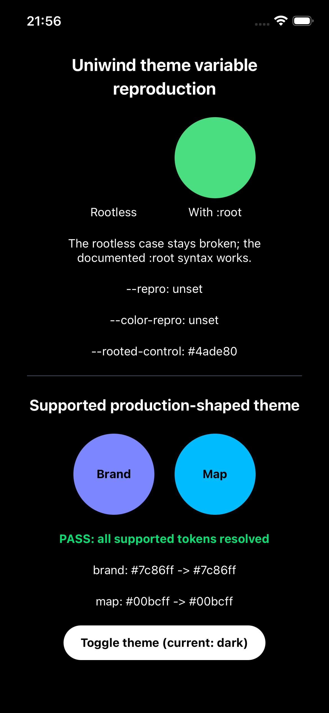

# Uniwind + Tailwind CSS 4.3.3 theme syntax verification

Minimal Expo project that preserves the rootless `@variant` reproduction and
verifies the documented `:root` syntax with:

- Uniwind 1.12.0
- Tailwind CSS 4.3.3
- Expo 57.0.20
- React Native 0.86.3

The repository sets `verifyDepsBeforeRun: error` so pnpm never repairs or
reinstalls dependencies implicitly while running a reproduction command.


## Reproduce

```bash
pnpm install
pnpm start
```

Open the app on iOS or Android.

## Original reproduction

The original expectation was that both circles would be visible and both the
raw and aliased rootless variables would resolve to concrete colors.

The actual result remains intentionally visible:

- The rootless custom color is not applied and resolves to `"unset"`.
- The otherwise identical `:root` control remains green and resolves to a
  concrete color.

Tailwind CSS 4.3.3 compiles the rootless theme variant to a selector shaped
like `:scope:where(.light, .light *)`. Uniwind 1.12.0 does not retain the
custom variable in the native scoped theme variables.

This is a silent regression: the build and typecheck complete successfully,
but runtime consumers receive the literal string `"unset"`.

## Supported syntax verification

The additional production-shaped case follows the syntax documented by
Uniwind. It defines light and dark variables under `:root`, exposes them
through `@theme inline static`, consumes the generated utilities and reads the
same aliases with `useCSSVariable`.

The screen must show:

- Visible Brand and Map circles with readable foreground text.
- `PASS: all supported tokens resolved` in both light and dark themes.
- Concrete raw and aliased values instead of `"unset"`.



The supported structure is:

```css
@layer theme {
  :root {
    @variant light {
      --repro: #2563eb;
    }

    @variant dark {
      --repro: #60a5fa;
    }
  }
}
```

## Upstream outcome

The Uniwind maintainer closed issue #669 as not planned on September 7, 2026.
Rootless `@variant` blocks are outside the supported syntax; projects should
use `@layer theme -> :root -> @variant`. Uniwind v2 may introduce custom theme
syntax under the project's control.

This repository keeps the unsupported case so the silent `"unset"` behavior
remains reproducible while documenting and exercising the supported migration
path.

## Related upstream work

- https://github.com/uni-stack/uniwind/issues/669
- https://github.com/uni-stack/uniwind/issues/661
- https://github.com/uni-stack/uniwind/pull/662
- https://github.com/uni-stack/uniwind/issues/623
