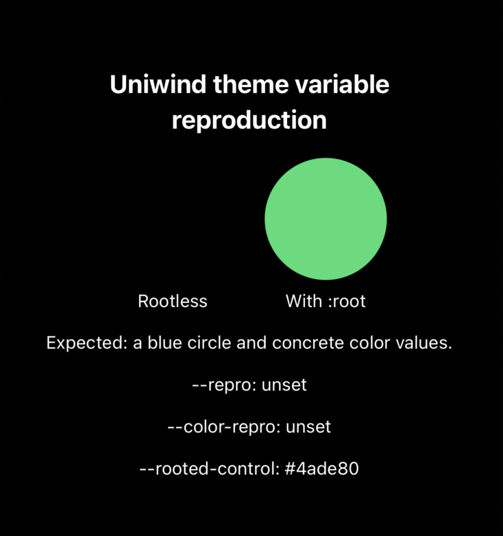

# Uniwind + Tailwind CSS 4.3.3 `:scope` reproduction

Minimal Expo reproduction for theme variables resolving to `"unset"` with:

- Uniwind 1.12.0
- Tailwind CSS 4.3.3
- Expo 57.0.20
- React Native 0.86.3



## Reproduce

```bash
pnpm install
pnpm start
```

Open the app on iOS or Android.

## Expected

- Both circles are visible: the rootless token is blue and the `:root` control
  is green.
- `useCSSVariable("--repro")` and `useCSSVariable("--color-repro")`
  resolve to concrete color values.

## Actual

- The rootless custom color is not applied and resolves to `"unset"`.
- The otherwise identical `:root` control remains green and resolves to a
  concrete color.

Tailwind CSS 4.3.3 compiles the rootless theme variant to a selector shaped
like `:scope:where(.light, .light *)`. Uniwind 1.12.0 does not retain the
custom variable in the native scoped theme variables.

This is a silent regression: the build and typecheck complete successfully,
but runtime consumers receive the literal string `"unset"`.

## Control cases

The same CSS worked with Uniwind 1.10.1 and Tailwind CSS 4.3.2.

Wrapping the variants in `:root` also avoids the failure:

```css
@layer theme {
  :root {
    @variant light {
      --repro: #2563eb;
    }

    @variant dark {
      --repro: #60a5fa;
    }
  }
}
```

If rootless `@variant` blocks are no longer supported, a compile-time warning
would prevent the current silent fallback to `"unset"`.

## Related upstream work

- https://github.com/uni-stack/uniwind/issues/661
- https://github.com/uni-stack/uniwind/pull/662
- https://github.com/uni-stack/uniwind/issues/623
